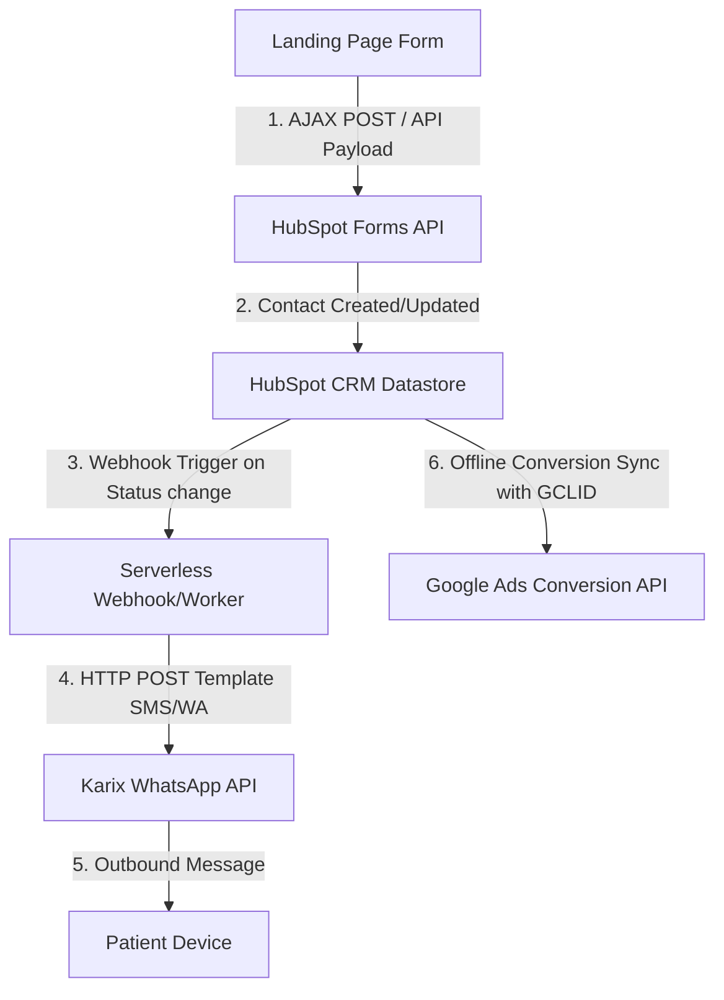
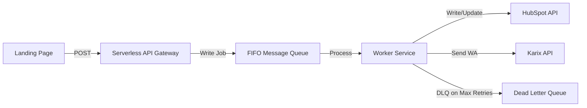

# System Integration Design: OrthoNow Lead & Conversion Pipeline

This document details the systems architecture, event orchestration, and API specifications for integrating OrthoNow's landing page, HubSpot CRM, Karix WhatsApp Gateway, and Google Ads.

---

## 1. System Architecture Diagram



---

## 2. Order of Events & Data Flow

1. **Submission**: User submits the 2-field form on the Landing Page. The client script captures the input (`name`, `phone`) along with `utm_source`, `utm_campaign`, and the Google Click Identifier (`gclid`) from the URL/cookies.
2. **CRM Ingestion**: The Landing Page executes a direct HTTP POST to the HubSpot Forms API.
3. **Deduplication & Record Lifecycle**:
   * **Contact Creation**: If the phone number is unique, HubSpot creates a new Contact record, setting the lifecycle stage to *Lead*.
   * **Contact Update**: If the phone number already exists, HubSpot merges the lead, updates the UTM history, appends the latest `gclid`, and logs a new form submission event on the contact timeline.
4. **WhatsApp Dispatch**: A HubSpot Workflow triggers on contact creation, calling a webhook that POSTs a template message payload to the **Karix WhatsApp API**.
5. **Conversion Attribution**: Once the contact is qualified (e.g., status updated to "Scheduled"), HubSpot's native integration uploads the saved `gclid` and conversion timestamp to the **Google Ads Offline Conversion API** to attribute the click.

---

## 3. Technical Specifications & API Operations

### A. Landing Page to HubSpot (HubSpot Forms API)
* **Endpoint**: `POST https://api.hsforms.com/submissions/v3/integration/submit/{portalId}/{formGuid}`
* **Payload Structure**:
```json
{
  "fields": [
    { "name": "firstname", "value": "John" },
    { "name": "phone", "value": "+15550199" },
    { "name": "gclid", "value": "Cj0KCQjwiMmwBhDxARIsABeQ7q1..." }
  ],
  "context": {
    "pageUri": "https://www.orthonowclinics.com/opinion",
    "pageName": "Get an Expert Orthopaedic Opinion"
  }
}
```

### B. HubSpot Webhook to Karix WhatsApp API
* **Endpoint**: `POST https://api.karix.io/message/whatsapp/v1/send`
* **Headers**: `Authorization: Bearer {Karix_API_Key}`
* **Payload Structure**:
```json
{
  "to": "+15550199",
  "channel": "whatsapp",
  "type": "template",
  "template": {
    "namespace": "orthonow_alerts",
    "name": "priority_booking_confirm",
    "language": { "code": "en" },
    "components": [
      {
        "type": "body",
        "parameters": [
          { "type": "text", "text": "John" }
        ]
      }
    ]
  }
}
```

---

## 4. Architectural Decisions & Rationale

### Why HubSpot Forms API is Chosen
The HubSpot Forms API acts as a secure gateway for standard client-side submissions. It supports native cross-origin (CORS) submissions directly from standard web forms while automatically capturing browser contextual details (IP address, page URI, and cookie values) needed for attribution tracking.

### Why Direct API Integration Instead of Zapier
1. **Security & HIPAA Compliance**: Eliminating middle-tier applications like Zapier prevents patient contact info (Name/Phone) from being logged or cached on third-party servers.
2. **Data Consistency**: Direct integration minimizes points of failure, ensures instantaneous execution, and allows for robust server-side error handling during lead ingestion.

---

## 5. Failure Analysis & System Resiliency Strategy

### The Biggest Failure Point: Silent Data Loss during Update Merges & Webhook Failures
The most critical vulnerability in this direct-to-CRM architecture is **silent data loss on duplicate submissions combined with unhandled outbound API failures**.
1. **Deduplication Trigger Bypass**: HubSpot natively deduplicates contacts by email address. Since this form collects *only* Name and Phone, standard form submissions can create duplicate records or merge updates. If a user submits a form with a duplicate phone number, HubSpot updates the existing contact rather than creating a new one. If the GTM/HubSpot workflows are triggered strictly on "Contact Creation", duplicate updates will **bypass** the workflow trigger entirely, failing to send the WhatsApp alert.
2. **Synchronous Webhook Failures**: If the Karix WhatsApp API suffers an outage, network timeout, or returns a `429 Too Many Requests` rate-limit status, HubSpot's native webhooks do not support robust, custom retry queues. The hook fails, and the patient never receives their confirmation, with no retry loop or developer visibility.

---

## 6. Fallback, Retry, and Monitoring Specifications

To build a production-grade, highly resilient system, we introduce a **Serverless Queue Middleware** (e.g., Node.js/Cloudflare Workers with AWS SQS or Redis BullMQ) between the landing page and the APIs.



### A. Fallback Strategy & Deduplication Handling
* The Landing Page submits data to the Serverless Gateway instead of HubSpot directly. 
* The gateway first writes the raw payload to the FIFO queue.
* The processing worker searches HubSpot by phone number (`POST /crm/v3/objects/contacts/search`). 
  * **If found**: Updates the existing contact and forces a custom date-time property update (`last_booking_submission_time`).
  * **If not found**: Creates a new contact record.
* The HubSpot Workflow triggers on *either* contact creation OR modification of `last_booking_submission_time`, eliminating trigger bypass.

### B. Retry Queue (Exponential Backoff with Jitter)
If calls to HubSpot or Karix fail (due to network timeout, 5xx errors, or 429 rate limits):
* The worker leaves the job in the queue with a backoff delay.
* **Algorithm**: Retry Delay = $Base \times 2^{attempt} + \text{random\_jitter}$ (e.g., retrying after 2s, 4s, 8s, 16s, up to a max of 5 attempts).
* If all 5 retries fail, the payload is moved to a **Dead Letter Queue (DLQ)** for manual reconciliation.

### C. Monitoring, Logging & Alerting
* **Structured Logging**: All worker actions write structured JSON logs to a central log aggregator (e.g., Datadog, AWS CloudWatch). **Crucial**: Logs must scrub raw `name` and `phone` values, recording only hashed phone identifiers and transaction IDs to maintain HIPAA/PII compliance.
* **Monitoring Metrics**: Track queue latency, queue depth, API success rates (200 vs 4xx/5xx responses), and webhook turnaround time.
* **Real-time Alerting**: Configure alerts (via PagerDuty, Slack, or email) to fire if:
  * The Dead Letter Queue (DLQ) depth is greater than 0.
  * API failure rate exceeds 2% over a rolling 5-minute window.
  * Serverless function execution times out (indicating network blockages).

---

## 7. WhatsApp 2-Minute SLA Delivery Guarantee Specifications

To guarantee that WhatsApp booking confirmations reach users within **2 minutes (120 seconds)** of form submission, we implement the following technical constraints across our integration pipeline.

### A. Dedicated High-Priority Queue Segmentation
* **Isolation**: Transactional confirmations must be routed through a dedicated **High-Priority FIFO Queue** (e.g., AWS SQS or Redis BullMQ). This queue is completely isolated from marketing, broadcast, or bulk notification traffic, preventing queue bottlenecks.
* **Worker Allocation**: Ensure a minimum pool of active concurrent worker nodes dedicated solely to processing this queue, guaranteeing message ingestion latency is $<100\text{ms}$.

### B. Aggressive Timeout Thresholds
To prevent hung connections from consuming worker threads:
* **API Connection Timeouts**: Set `connect_timeout = 2000ms` and `read_timeout = 3000ms` for all external HTTP requests.
* If a downstream API (HubSpot or Karix) fails to respond within 5 seconds, the request is immediately aborted and queued for retry.

### C. SLA-Optimized Retry Intervals
Standard exponential backoff scales too slowly for a 2-minute delivery window. We implement a custom fast-retry loop for transient failures (network timeouts, 5xx errors, or Karix 429s):
* **Attempt 1**: Retry after **5 seconds**
* **Attempt 2**: Retry after **15 seconds**
* **Attempt 3**: Retry after **30 seconds**
* **Attempt 4**: Retry after **45 seconds**
* *Total elapsed retry cycle*: **95 seconds**. This ensures 5 total attempts are completed within the 120-second threshold.

### D. Outbound Karix API Rate Limiting & Optimization
* **Leaky Bucket Pattern**: Rather than hitting Karix rate limits and failing, the worker uses a sliding window rate limiter (e.g., max 50 requests/sec) to queue and pace outgoing messages smoothly.
* **Keep-Alive Connections**: Maintain persistent TCP/HTTP keep-alive connections to `api.karix.io` inside the worker environment to eliminate TLS/TCP handshake overhead ($~150\text{ms}$ saved per transaction).

### E. Webhook Delivery Receipt (DLR) Monitoring & Failover SMS
* **Webhook DLR Monitoring**: Set up a Karix webhook listener to capture delivery statuses (`delivered`, `read`). 
* **Failover SMS Rule**: If the webhook listener does not receive a `delivered` status payload from Karix within **60 seconds** of message creation (which indicates the user is offline, WhatsApp service is down, or has no cellular data), the system automatically triggers a fallback transactional SMS via Karix SMS API to ensure delivery of confirmation info.

### F. SLA Alerts & Server Monitoring
* **Serverless Node Autoscaling**: Scale worker capacity automatically based on queue age. If a message sits in the queue for $>1000\text{ms}$ without being picked up, spin up additional worker nodes.
* **Datadog SLA Breach Alerts**: Set up an alert calculating the delta between `form_submit` timestamp and `dlr_received` (or SMS trigger) timestamp.
  * **Warning (Yellow)**: If latency exceeds **90 seconds**.
  * **Critical Incident (Red - PagerDuty)**: If latency exceeds **120 seconds**.


